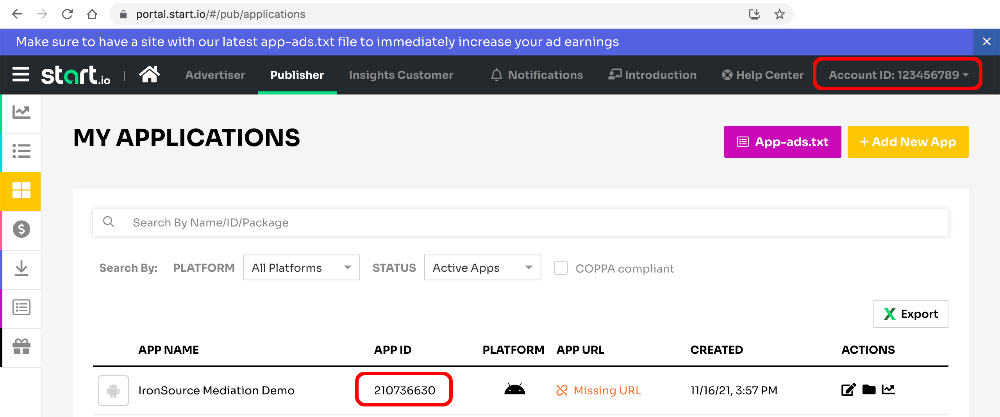

# Start.io mediation adapter for AppLovin MAX

This library lets you serve ads to your apps from StartApp network via AppLovin MAX integration.

## Supported formats

- Banner 320x50
- Banner 300x250 (Medium Rectangle)
- Interstitial
- Rewarded Video
- Native

## Setup Start.io

1. [Open a Publisher account][1]
2. [Add an App][2]
3. Make sure you can find an **Account ID** and an **App ID**


## Setup AppLovin MAX

1. Add Start.io network as a Custom Network for mediation. Navigate to Mediation -> Manage -> Networks and click corresponding button.


2. Choose `Network Type` value `SDK` and fill other parameters:

**Custom Network Name**

```
Start.io
```

**iOS Adapter Class Name**

```
StartioAppLovinAdapter
```

**Android / Fire OS Adapter Class Name**

```
com.applovin.mediation.adapters.StartAppMediationAdapter
```


3. Configure newly added network to work with your Ad Units. Navigate to Mediation -> Manage -> Ad Units.

Then choose an Ad Unit you want to use with Start.io and scroll down to section `Custom Networks & Deals`.

Toggle switch `Status` to make it activated and displayed in green.

Field `App ID` is mandatory no matter that in dashboard it is marked as optional.

**Important**: You have to use the same App ID from the Start.io portal for all Ad Units in frame of single app!


4. Advanced configuration of Ad Units

You can pass plain JSON string into the field `Custom Parameters` for advanced configuration:

```json
{
    "adTag": "string",
    "interstitialMode": "string", // one of "overlay", "video", "offerwall"
    "minCPM": "number",
    "is3DBanner": "boolean", // applicable only for banner 320x50
    "nativeImageSize": "string", // one of "72x72", "100x100", "150x150", "340x340", "1200x628"
    "nativeSecondaryImageSize": "string" // one of "72x72", "100x100", "150x150", "340x340", "1200x628"
}
```

## Setup project

Add dependency on Start.io mediation adapter for AppLovin MAX

```groovy
dependencies {
    // noinspection GradleDependency
    implementation 'com.startapp:applovin-mediation:1.1+'
}
```

## Build an example app

You must put AppLovin SDK Key into `local.properties` before build

```properties
applovin.sdk.key=
```

You should put an appropriate Ad Unit ID into `local.properties` in order to test specific placement

```properties
applovin.ad.banner=
applovin.ad.mrec=
applovin.ad.native.small=
applovin.ad.native.medium=
applovin.ad.native.manual=
applovin.ad.interstitial=
applovin.ad.rewarded=
applovin.test.devices=
```

You should put comma-separated list of advertising IDs into `local.properties` in order to receive test ads

```properties
applovin.test.devices=
```

## Testing

**Important**: currently mediation doesn't work with test mode.

You can force Start.io to display the test ad by adding the following line somewhere in your code:

```java
StartAppSDK.setTestAdsEnabled(true);
```

 [1]: https://support.start.io/hc/en-us/articles/202766673
 [2]: https://support.start.io/hc/en-us/articles/202766743
